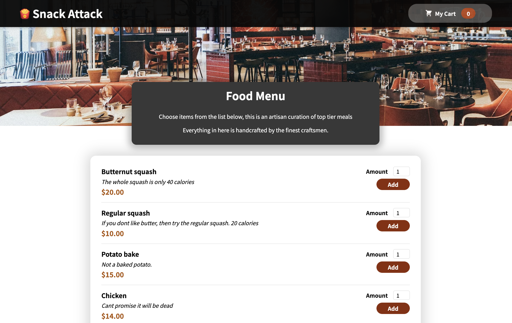
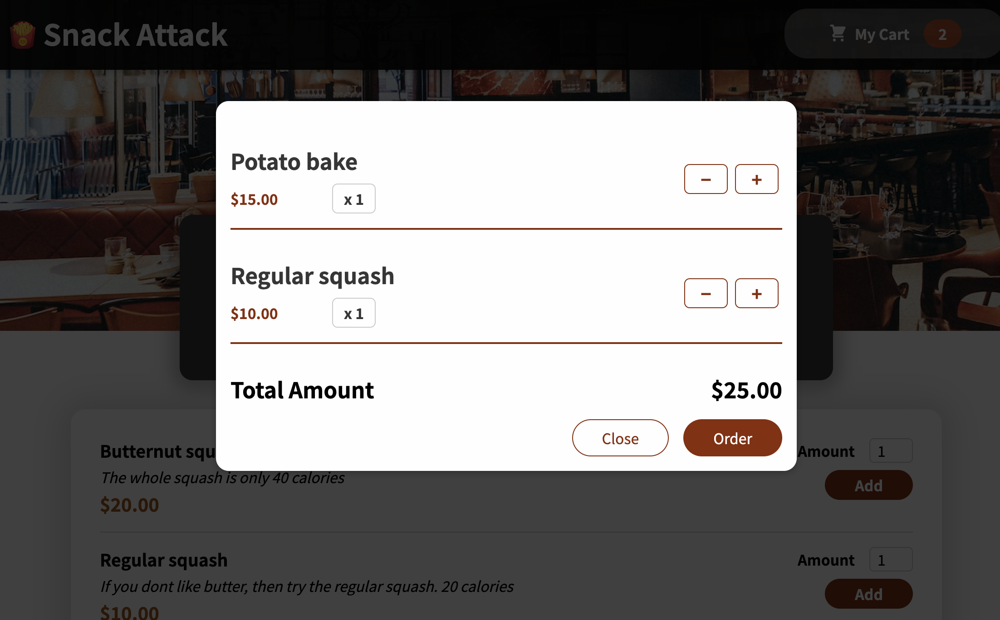

# React Food Ordering App

This is a dummy template project that I built with `create-react-app` to learn React as part of the Udemy React course by Academind. It contains a menu, a cart, and state management using React context. It can be connected to a backend by modifying `utils/api.js` to retrieve actual data, and making some minor modifications to the code in AvailableMeals.js and Cart.js.

## Screenshots

